```{r setup, include=FALSE}
options(htmltools.dir.version = FALSE)
```

```{r eval=FALSE, echo=FALSE}
rmarkdown::render("./hls_2017/index.Rmd")
xaringan::inf_mr()
```

class: inverse, middle

.center[

# **Don't miss out...       **

]

.pull-left[

- <white>These slides and all materiales are available on github</white>

- <white>Write down contact information in case you have to leave early</white>

]

.pull-right[

<a href="mailto:joseph.casillas@rutgers.edu"><white><i class="fa fa-paper-plane fa-fw"></i></white>&nbsp; <white>joseph.casillas@rutgers.edu</a></white><br>
<a href="https:www.jvcasillas.com/psychopy_ws"><white><i class="fa fa-link fa-fw"></i></white>&nbsp; <white>jvcasillas.com/psychopy_ws</a></white><br>
<a href="http://twitter.com/jvcasill"><white><i class="fa fa-twitter fa-fw"></i></white>&nbsp; <white>@jvcasill</a></white><br>
<a href="http://github.com/jvcasillas"><white><i class="fa fa-github fa-fw"></i></white>&nbsp; <white>@jvcasillas</a></white><br>

]

---
background-image: url(http://blueforeststudios.com/azultree/wp-content/uploads/2015/11/Real-time-marketing.jpg)
background-size: 600px
background-position: 100% 50%

# What are we doing?

### Part I - Best practices

- Bilingual language modes
- Language proficiency
- Language dominance

--

### Part II - PsychoPy2

- What is psychopy and why do you want it?
- Where and how do you get it?
- What is psychopy good for?
- What is psychopy not good for?
- Demo: stroop task
- Bonus:
  - integration with R, project management
  - OSF, templates and reproducible research

---
class: inverse, middle, center

# Part I

### Best practices for pycholinguistic research with bilinguals

---
background-image: url(../assets/img/modes.png)
background-size: 300pt
background-position: 20% 50%
background-color: black
class: right

# Bilingual language modes

---

# Bilingual language modes

### The basics

- What are they?
- Why are they important to me?
- What do I need to know/do?

---

# Bilingual language modes

<div style="float:right">
  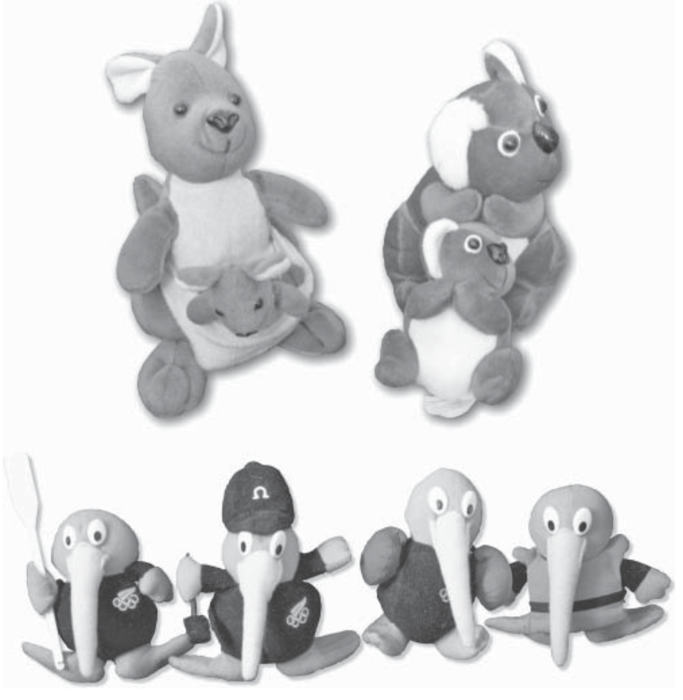
</div>

### Stuffed toys and perceptual boundary shifts

- Hay & Drager (2010)
- Gonzales & Lotto (2013)
- Antoniou, Best & Tyler (2013)

### Production asymmetries

- Antoniou, Best, Tyler & Kroos (2010, 2011)


---
background-image: url(../assets/img/proficiency.gif)
background-size: 350pt
background-position: 20% 65%
background-color: black
class: right

# Language proficiency

### ...and how to measure it

---

# Language proficiency

### The basics

- What is it?
- Why do I care?
- What do I need to know/do?

### Options

- LexTALE
- DELE

---
background-color: black
class: right

# Language dominance 

### ...and how to measure it

---

# Language dominance

### The basics

- What is it?
- Why is it important to me?
- What do I need to know/do?

### Options

- BLP
- Multi-Lingual Naming Test MINT

---


class: inverse, middle, center

# Part II

## Introduction to PsychoPy2

---
class: center, middle

# Who is this for?

---
class: middle

<div style="float:right">
  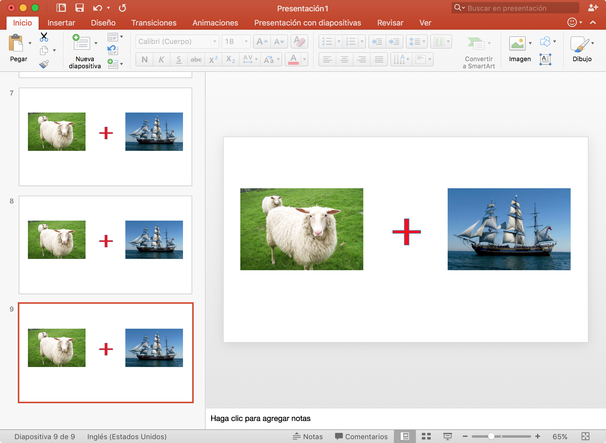
</div>

--

background-image: url(https://www.govloop.com/wp-content/uploads/2016/08/powerpoint-hacks.gif)
background-position: 10% 50%
background-size: 300px

---
class: middle
background-image: url(../assets/img/right_arrow.png)
background-position: 50% 50%
background-size: 75px

<div>
  
  
  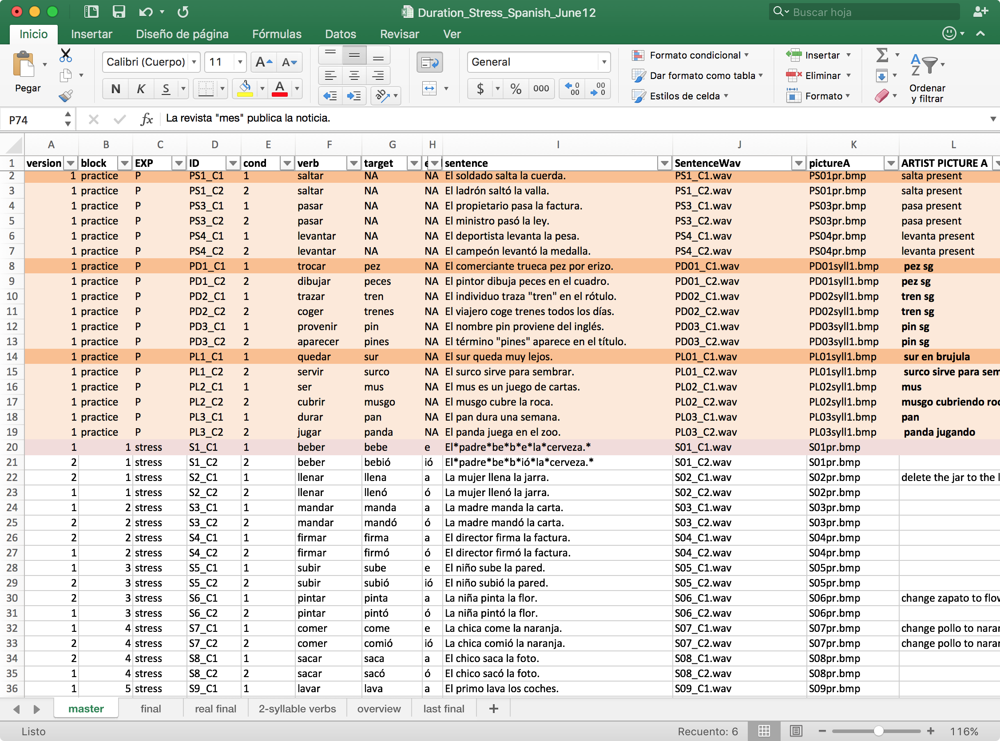
</div>

---
background-image: url(../assets/img/excel2.png)
background-position: 50% 50%
background-size: contain

---
class: center, middle
background-image: url(https://i.ytimg.com/vi/jiGjP04HTRU/maxresdefault.jpg)
background-position: 50% 10%
background-size: 700px

--

</br></br></br></br></br></br></br></br></br></br></br></br></br>
# 💰💸🤑💵

---
class: center, middle

# Problems?

### Not efficient  

### Not accurate  

### Not reproducible  

### Not free

---

# Goals

### Provide an overview of PsychoPy2

- What is it? 
- How does it work?

### Why you should care

- Gain better understanding of psycholinguistic experiments

### What will you learn?

- You will be able to create your own simple experiment
- You will have the resources to create more complicated experiments

---
class: inverse, middle, center

# Overview

---

# Overview

### What is it?

- PsychoPy2 is a free program made in Python 
- It can be used to create experiments in psychology, psychophysics, neuroscience and linguistics.

</br>

--

### Why do you want it?

- It's free!
- It's cross-platform
- It has a GUI (builder mode) or you can write in code

---

# Overview

### What is it good for?

- PsychoPy2 can be used to create psycholinguistic tasks: 
    - 2AFC
    - AX, AXB, ABX
    - Lexical decision (masked prime)
    - Production experiments
    - Pretty much anything you can design

</br>

--

### What is it not good for?

- ?

---
class: inverse, center, middle

# Getting started

---
class: inverse, center

# How to...

## 1. **Just watch**

--

## 2. **Follow along with me**

--

www.jvcasillas.com/psychopy_ws

---
class: inverse, middle, center

# You should have PsychoPy2 installed 
--

# If not, get it here: https://github.com/psychopy/psychopy/releases

--

### ...**but hurry!**

---
class: inverse, middle, center

# A simple experiment

---

# A simple experiment

### Two alternative forced-choice grammaticality judgment task

- We are interested in studying age effects in second language acquisition. 

--

- We decide to look at the acquisition of verb morphology in L2 learners of English (based on Johnson & Newport, 1989)

--

- We want to show our participants a series of sentences.

--

- Some sentences will contain incorrect past tense morphology and some sentences will 
be grammatical.

--

- Participants will see the sentences on the screen and decide if they are grammatically correct of incorrect.

--

- Our hypothesis: We expect a negative correlation between age of acquisition and response accuracy.

---
background-image: url(../assets/img/psy/01.png)
background-size: 600px
background-position: 100% 50%

# Setting up...

- Create a folder on your desktop

- Call it **myexp**

- Open PsychoPy

---
class: inverse, middle, center

# The interface

---

# The interface (Coder mode)

.pull-left[

```
import itertools

def iter_primes():
  # an iterator of all numbers between 2 and +infinity
  numbers = itertools.count(2)

  # generate primes forever
  while True:
  # get the first number from the iterator
    prime = numbers.next()
    yield prime
for p in iter_primes():
  if p > 1000:
    break
  print p
```

]

.pull-right[

<div style="float: right">
  
</div>

]

---
background-image: url(../assets/img/psy/02.png)
background-size: contain

---
background-image: url(../assets/img/psy/02a.png)
background-size: contain

---

# The interface (Builder mode)

<div style="float: right">
  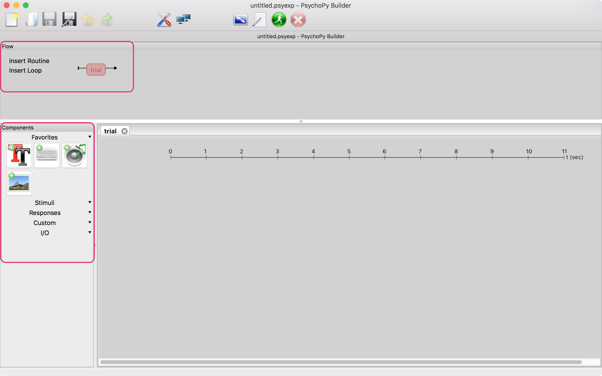
</div>

- Provides a graphical user interface

- Linear representation of experiment **flow**

- Row view of routine <blue>components</blue>

---
background-image: url(../assets/img/psy/03a.png), url(../assets/img/psy/03b.png), url(../assets/img/psy/03c.png)
background-size: 50px, 400px, 50px
background-position: 55% 23%, 95% 50%, 55% 37%

# Presenting text - Stimuli components

- Click on the large "T" to create a text component

- Click "OK" after a new window pops up. 

- Click the disk icon to save your experiment in the  
**myexp** folder on your desktop

- Call it ```myexp.psyexp```

---
background-image: url(../assets/img/psy/04a.png), url(../assets/img/psy/04.png)
background-size: 50px, 1250px
background-position: 65.5% 72%, 50% 50%
class: middle,

</br></br></br></br></br>


.pull-right[

### - The text component appears as part of our trial routine

### - Click the &nbsp; &nbsp; &nbsp; &nbsp; &nbsp; &nbsp; icon to run the experiment

]

---

# Running the experiment

<div style="float: right">
  
  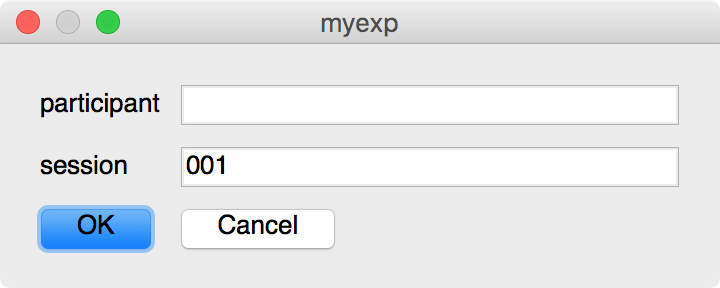
</div>

- Every time you run the experiment you will be prompted with an info window

- Here you can include important information about your experiment

- For now we will leave this information as is. Click OK. 

- What happened?

--

<div style="float: right">
  
</div>

- Click on the 'text' component

---

# Presenting text - Stimuli components

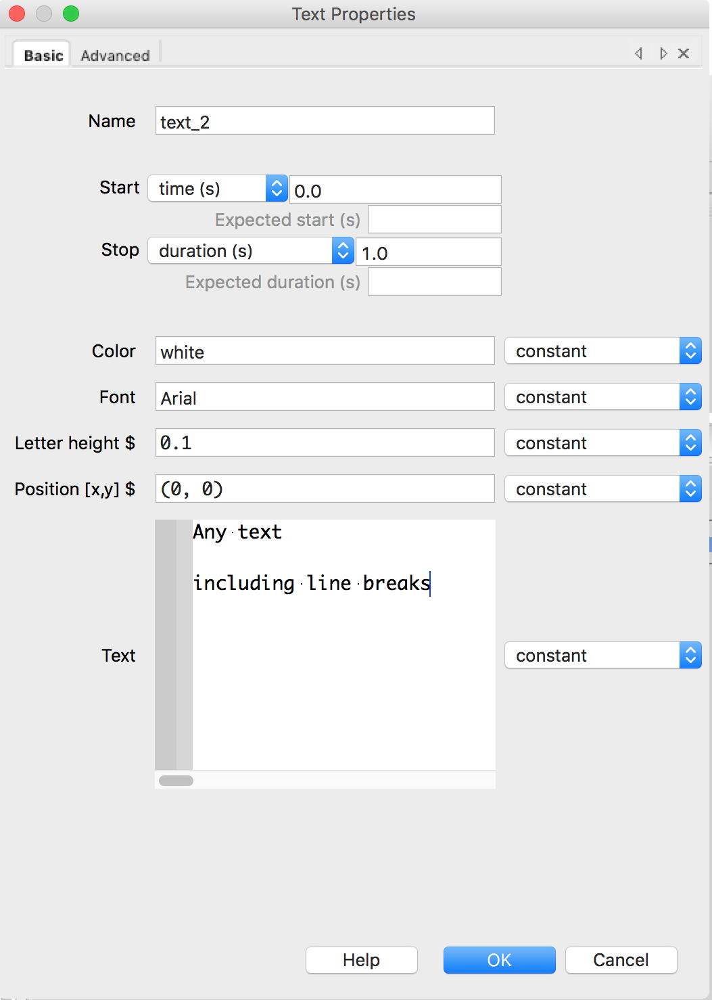

--

background-image: url(../assets/img/psy/06b.png)
background-size: 350px
background-position: 65% 78%

---
background-image: url(../assets/img/psy/07.png)
background-size: contain
background-color: grey

---

# **What did we learn?**

1. We can use **stimuli text components** to present text on  
the screen in a <blue>routine</blue>

2. We can give the components useful names

3. We can control *when*, *where*, and for *how long*  
the text appears

4. We can also adjust the font and the colors

5. It is possible to present stimuli other than text  
(i.e., sounds, images, videos, etc.)

--

background-image: url(../assets/img/psy/06c.png)
background-size: 400px
background-position: 95% 50%

### Now click the text component again and delete the  
### duration (make it blank)

---
background-image: url(../assets/img/psy/08b.png), url(../assets/img/psy/08a.png), url(../assets/img/psy/03c.png), url(../assets/img/psy/09.png)
background-size: 50px, 350px, 50px, 350px
background-position: 39.5% 23%, 25% 100%, 44% 37%, 80% 100%

# Participant control - Response components

- Click on the large keyboard icon &nbsp; &nbsp; &nbsp; &nbsp; &nbsp; &nbsp; to create a **key response** component

- Make yours look like the one below

- Click "OK" and then click the disk icon &nbsp; &nbsp; &nbsp; &nbsp; &nbsp; &nbsp; to save

---
background-image: url(../assets/img/psy/08b.png)
background-size: 50px
background-position: 46.5% 28.5%

# Participant control - Response components

- Participants will now be able to use the left and right arrow keys to make their judgments

- Now let's add two more text components &nbsp; &nbsp; &nbsp; &nbsp; &nbsp; &nbsp; to help them decide
  - On the left side we'll put a 'Correct' text component
  - On the right side we'll put an 'Incorrect' text component

<div>
  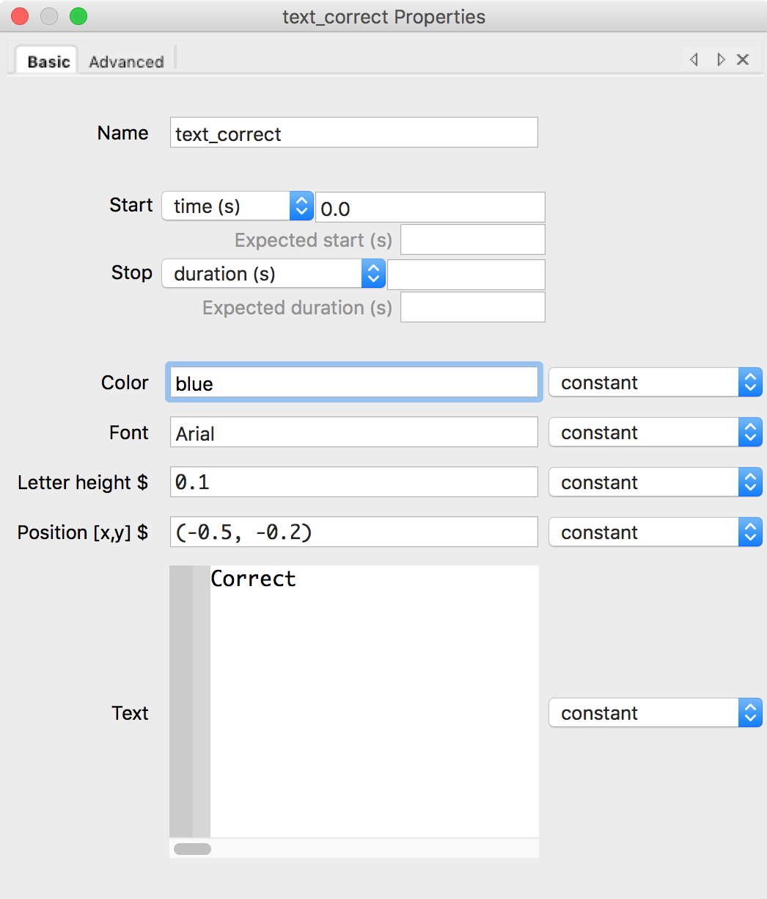
  
  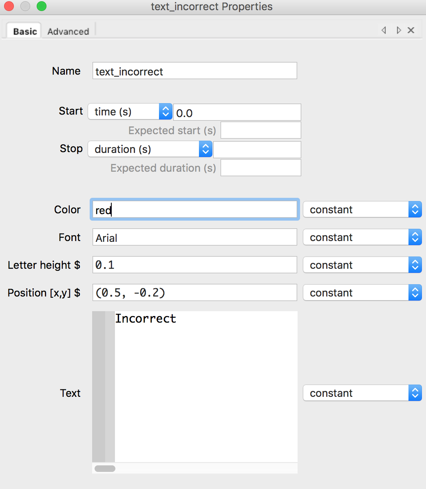
</div>

---
class: middle, center

<div>
  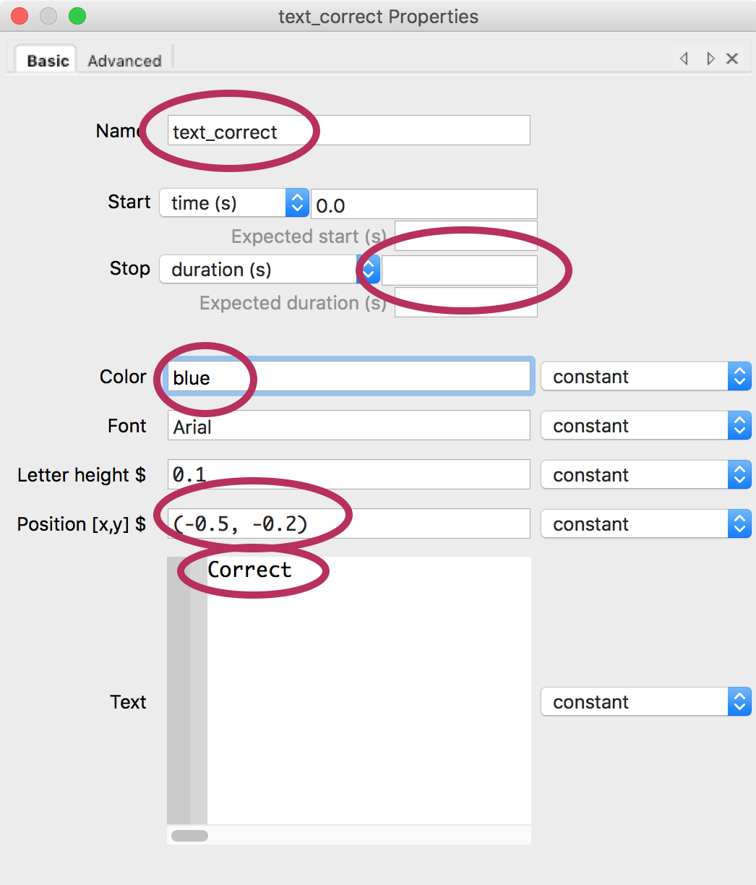
  
  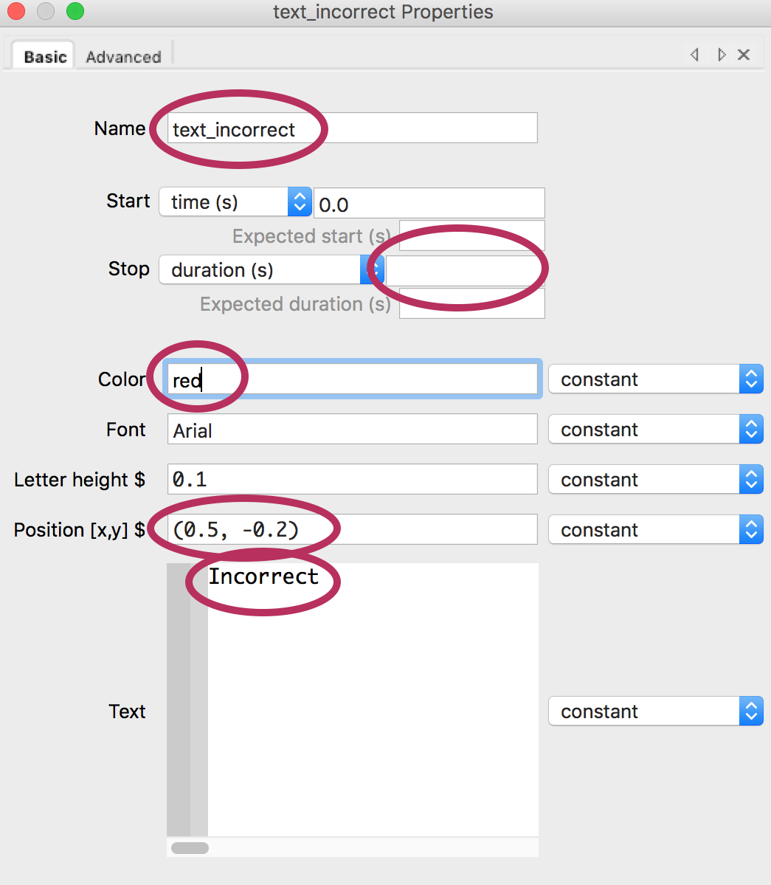
</div>

---
background-image: url(../assets/img/psy/12.png)
background-size: contain
background-color: grey

---
background-image: url(../assets/img/psy/13.png)
background-size: contain
background-color: grey

---

# **What did we learn?**

1. We can include **keyboard response components** in our <blue>routine</blue> to record participants' responses

2. We will often use response components in conjunction with stimuli components

3. We control *how long* they last and *what* they record 

4. There are many response possible components (i.e., keyboards, button boxes, microphones, mouse clicks, etc.)

--

### How do we include many trials?

--

<div align="center">
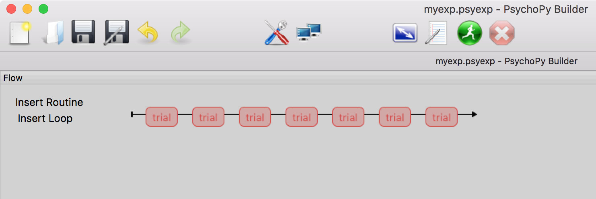
</div>

---

# Condition files and loops

- The solution is to create a **condition file** with all our trials and *loop* through them in a single <blue>routine</blue>
- 2 options: .csv file (textedit.app, notepad) or .xlsx file (excel)
- Choose your favorite and make a file with the following characteristics:

<div>
  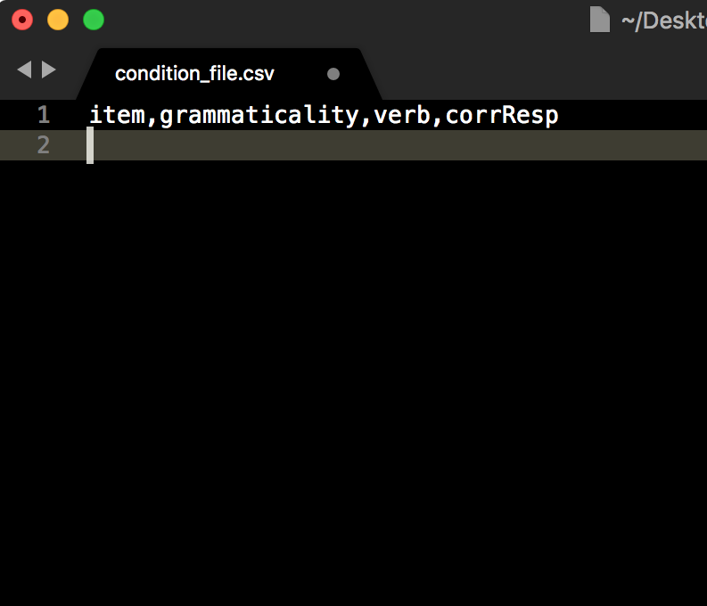
  
  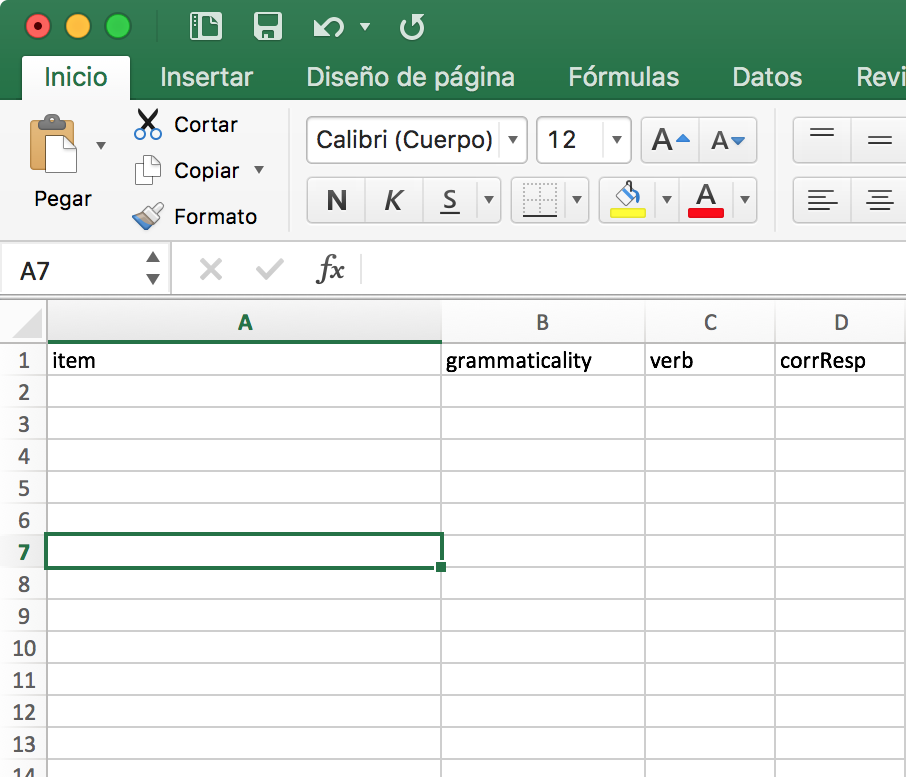
</div>

---

<div>
  
  
  
</div>

- Each column represents a variable in our experiment
- Use informative variable labels
- Avoid spaces, unusual characters, periods, etc.
--

- I have included
  - <blue>item</blue>: the experimental item (sentence) to be displayed
  - <blue>grammaticality</blue>: if the sentence is grammatical or ungrammatical
  - <blue>verb</blue>: the infinitive of the verb
  - <blue>corrResp</blue>: whether the *correct response* corresponds with the left arrow (correct) or the right arrow (incorrect)

---

<div>
  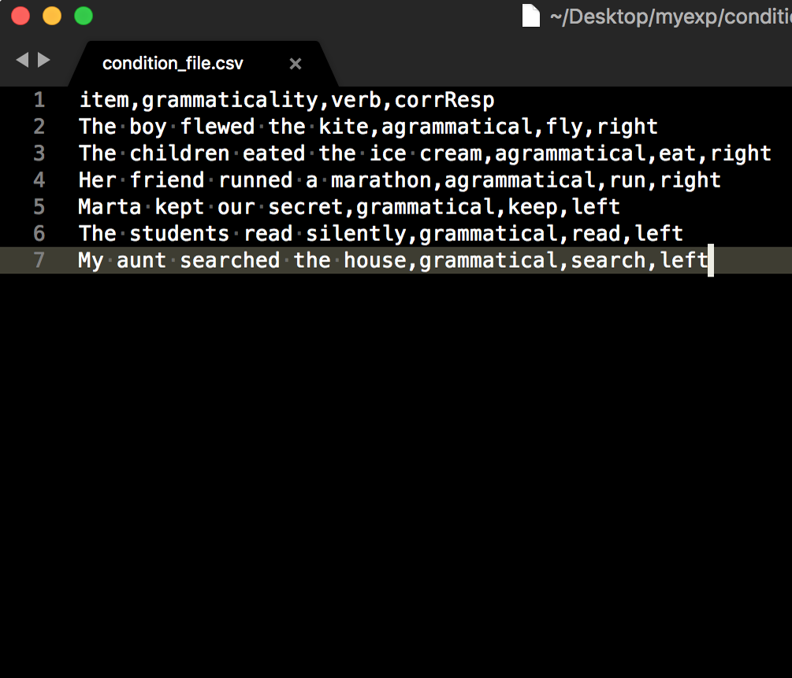
  
  
</div>

- Create any sentences you want (or copy these ones)
- Save the file to the **myexp** folder
- Name the file **condition_file.csv** (or condition_file.xlsx)

---

# Condition files and loops

- We are ready to **loop** through our trials in our <blue>routine</blue>

- Click 'Insert Loop' from the *flow* menu

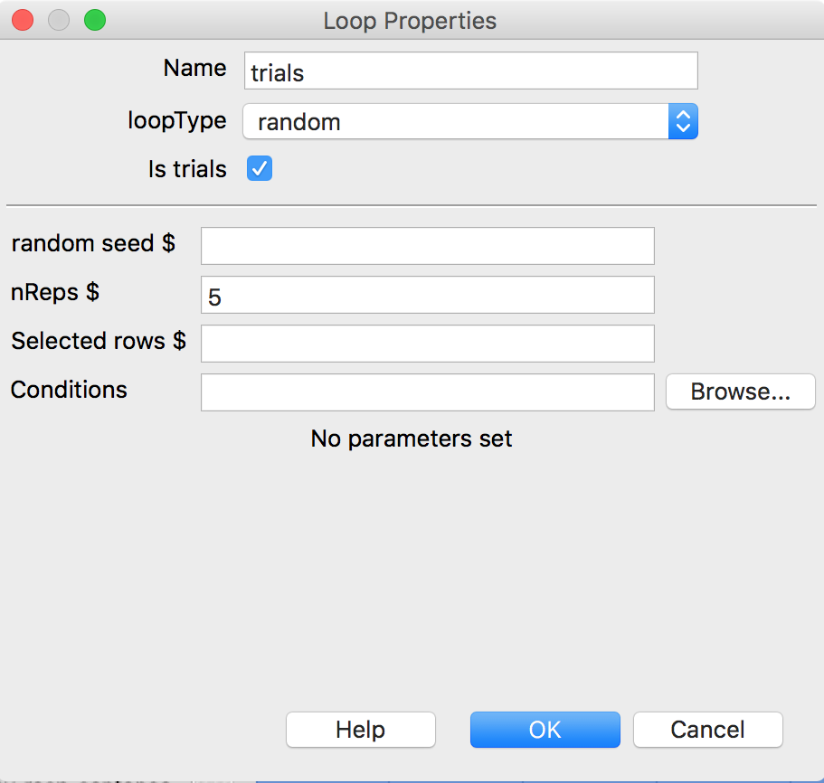

--

background-image: url(../assets/img/right_arrow.png), url(../assets/img/psy/17a.png)
background-size: 75px, 350px
background-position: 40% 60%, 63% 70%

---
class: middle, center
background-image: url(../assets/img/psy/17b.png), url(../assets/img/right_arrow.png), url(../assets/img/psy/17c.png)
background-size: 350px, 75px, 350px
background-position: 25% 10%, 50% 20%, 75% 10%

--

<div>
  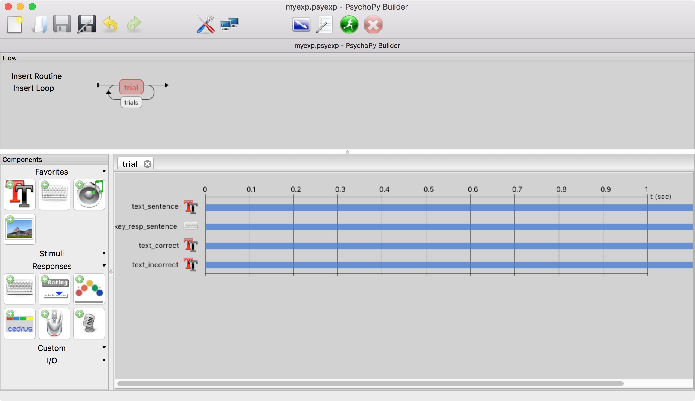
</div>

---

# Condition files and loops

- The loops is ready, but we need to let our **text_sentence component** know about our <blue>condition_file</blue>

- Click on **text_sentence** 

- We are going to tell the text component that we want it to present the items in our condition file from the column called *item*

---
class: middle

<div align="center">
  
  
  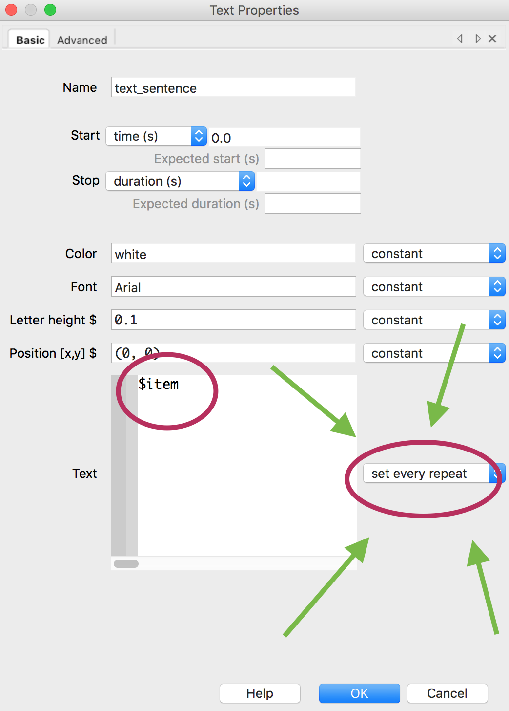
</div>

- The **$** tells python that 'item' is a variable that needs to be updated on each trial
- Do not forgot to change the text constant to "set every repeat"!!!

---

# Condition files and loops

- We can also tell psychopy that we know what the correct answer should be for each trial 

- We created this variable in our **condition_file** in the column <blue>corrResp</blue>

- So we need to update our key_resp_sentence component so that it logs the correct responses

- Click on "key_resp_sentence"

---
class: middle

<div align="center">
  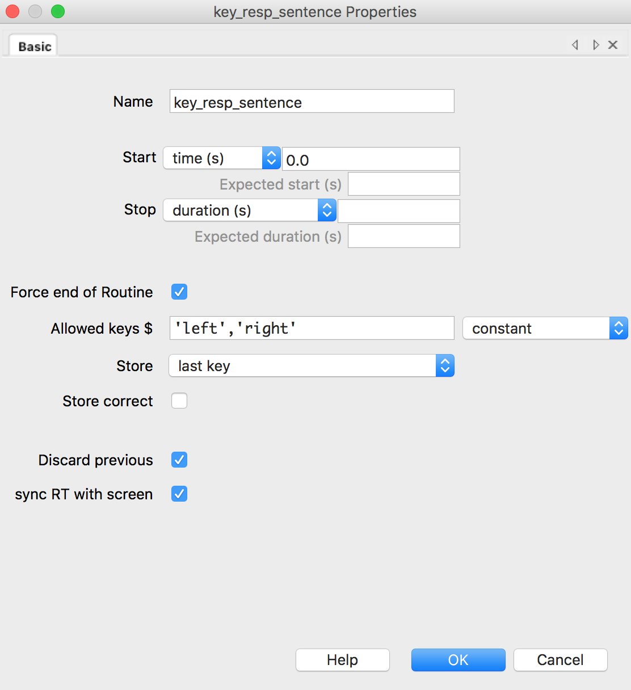
  
  
</div>

</br>

--

- If our participant gets the answer wrong, pyschopy will store a 0, if the answer is correct it will store a 1

---
background-image: url(../assets/img/psy/21c.png)
background-size: 50px
background-position: 44.5% 49%

# Almost done...

### But what about age of acquisition???

- Our hypothesis is that AoA is negatively correlated with response accuracy

- We need to include AoA in the experiment so that it will be logged for each participant

- Click on the **experiment settings** icon &nbsp; &nbsp; &nbsp; &nbsp; &nbsp; &nbsp; to adjust the "experiment info" field

---
background-image: url(../assets/img/psy/21a.png), url(../assets/img/psy/21b.png)
background-size: 500px, 500px
background-position: 5% 50%, 95% 50%

---

# Run the experiment!

- After you have made the final changes, save, and run the experiment

- You can now fill out the info prompt with your participants data

<div align="center">
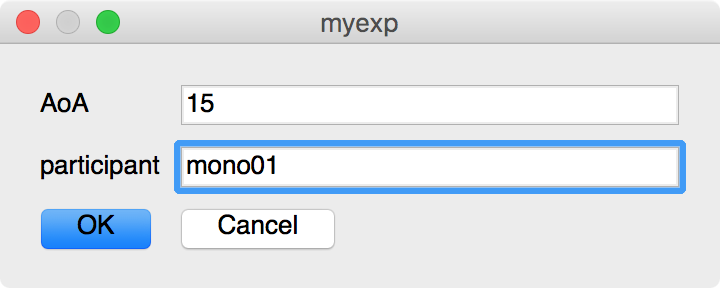
</div>

---

# What did we learn?

- We can display as many items as we want using routines

- The most efficient way to do this is to create a **condition file** and <blue>loop</blue> through the items

- We can refer to the variables (column names) of our condition file in components using **$** (i.e., $item)

- Whenever we use a loop we must change the variable in question to *set every repeat*

---

# Results

- Look inside your **myexp** folder for a new folder called "data"

- You should see several log files and .csv files

<div align="center">
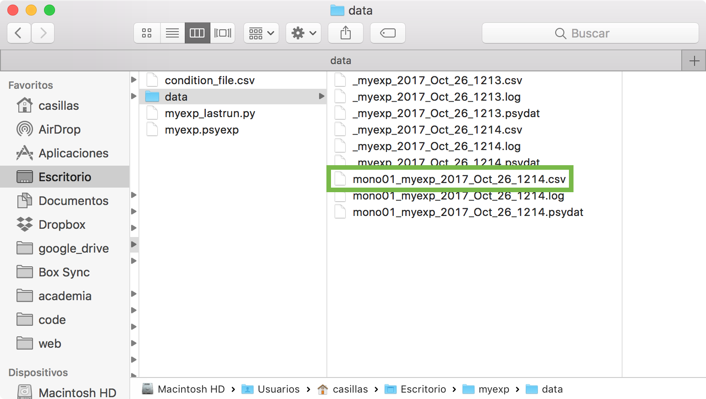
</div>

---
background-image: url(../assets/img/psy/24.png)
background-size: contain

- The experiment output is a .csv file that contains all of our variables in the condition file

- The log files are good for troubleshooting, but in general you can ignore them

- **Note**: the output is a tidy data frame i.e., each column is a variable and every row is a trial

- This is the optimal format for our data for visualization and analysis (in R, for example)

---

# Final touches

### Adding instructions

- It is usually necessary to give our participants instructions so they understand the task 

- Let's include a new routine before our loop

- What components do we need?

--

- Add a **text component** to display the instructions and a **key response component** to begin the experiment

---
background-image: url(../assets/img/psy/25.png)
background-size: contain
class: inverse

---
background-image: url(../assets/img/psy/26.png)
background-size: contain
class: inverse

---
background-image: url(../assets/img/psy/27.png)
background-size: contain
class: inverse

---
background-image: url(../assets/img/psy/28a.png)
background-size: contain
class: inverse

---
background-image: url(../assets/img/psy/28b.png)
background-size: contain
class: inverse

---

# Optional

### Say thank you to your participants 

- Create an "end" routine after the loop

- What components do you need?

---
background-image: url(../assets/img/psy/29a.png)
background-size: contain
class: inverse

---
background-image: url(../assets/img/psy/29b.png)
background-size: contain
class: inverse

---
background-image: url(../assets/img/psy/30.png)
background-size: contain
class: inverse

---

# Congratulations

### You now know the basics of Pyschopy2

</br>

<div align="center">
  
</div>

---

# Conclusion

### Pros

- Free
- Allows for control over everything
- Efficient
- Easy to streamline into reproducible research workflow
- Bright future!

### Cons

- Complicated?
- Ugly?

---
class: inverse, center, middle

# **Extras**

---
class: inverse, center, middle

# Creating new experiments

---

# Creating new experiments

### Avoid starting from scratch

- If you want to try a new experimental paradigm somebody has probably done it already

- Search for other finished experiments to use as templates

### OSF

- https://osf.io/g6dcu/

- Repository for psychopy templates

- Feel free to use, edit, share

- Have you made a cool experiment? Contribute!

---
class: inverse, middle, center

# You made an awesome experiment, collected data... now what?

---

# Dealing with results

- Specify the output format
- Import results directly into stats program

---
class: inverse, middle, center

# Getting help...

---

# Getting help

### Forums

- https://stackoverflow.com/search?q=psychopy
- https://discourse.psychopy.org
- http://code.google.com/p/psychopy/ 
- https://github.com/psychopy/psychopy

### More resources

- http://www.jvcasillas.com/psychopy_ws/
- http://www.psychopy.org/ 
- Email me!

---
class: inverse, middle, center
background-image: url(../assets/img/ru.png)
background-size: 50px
background-position: 50% 10%


# **Thank you!**


Slides and all materials are on github

<a href="mailto:joseph.casillas@rutgers.edu"><white><i class="fa fa-paper-plane fa-fw"></i></white>&nbsp; <white>joseph.casillas@rutgers.edu</a></white><br>
<a href="http:www.jvcasillas.com/psychopy_ws"><white><i class="fa fa-link fa-fw"></i></white>&nbsp; <white>jvcasillas.com/psychopy_ws</a></white><br>
<a href="http://twitter.com/jvcasill"><white><i class="fa fa-twitter fa-fw"></i></white>&nbsp; <white>@jvcasill</a></white><br>
<a href="http://github.com/jvcasillas"><white><i class="fa fa-github fa-fw"></i></white>&nbsp; <white>@jvcasillas</a></white><br>


---

# References

- <font size="5">Gray, J. & Pasmanter, N. (2013). [github][github]</font>
- <font size="5">Lejuez, C. W., Aklin, W. M., Zvolensky, M. J., & Pedulla, C. M. (2003). Evaluation of the Balloon Analogue Risk Task (BART) as a predictor of adolescent real-world risk-taking behaviours. Journal of adolescence, 26(4), 475-479. </font>
- <font size="5">McGuire, G. (2010, in progress) A Brief Primer on Experimental Designs in Speech Perception Research. http://people.ucsc.edu/~gmcguir1/ </font>
- <font size="5">Simonet, M. (2012). El diseño de experimentos para el estudio de la percepción del habla. *Laboratory Approaches to Romance Phonology Conference*. El Colegio de México, México D.F.</font>


[github]: https://github.com/psychopy/psychopy/tree/master/psychopy/demos/builder/mental_rotation


