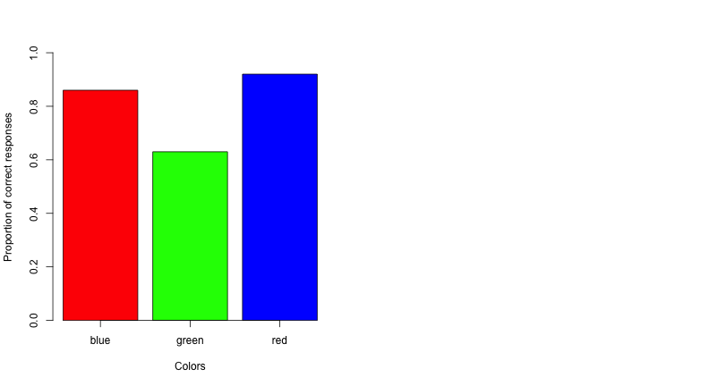

## Goals

### Provide an overview of PsychoPy2

- What is it? 
- How does it work?

### Why you should care

- Gain better understanding of psycholinguistic experiments

### What will you learn?

- You will be able to create your own simple experiment
- You will have the resources to create more complicated experiments

---

## Plan

- Overview of PsychoPy2
- Demo
- Using PsychoPy2 - the interface
- Creating a simple experiment - Stroop task
- Dealing with results
- Concluding ideas

--- .segue bg:grey

# Overview

---

## What is it?

- PsychoPy2 is a free program made in Python 
- It can be used to create experiments in psychology, psychophysics, neuroscience and linguistics.

</br>

## Why do you want it?

- It's free!
- It's cross-platform
- It has a GUI (builder mode) or you can write in code

---

## What is it good for?

- PsychoPy2 can be used to create psycholinguistic tasks: 
    - 2AFC
    - AX, AXB, ABX
    - Lexical decision (masked prime)
    - even production experiments

</br>

## What is it not good for?

- ?

---

## Getting started

### Download latest version of PsychoPy2

- http://sourceforge.net/projects/psychpy/files/PsychoPy/
- You can also google 'psychopy'
- Choose 'standalone' version

</br>

### Download workshop files

- http://www.jvcasillas.com/teaching/psychopy/

--- .segue bg:grey

# Examples

--- &twocol w1:40% w2:60%

## Risky business

*** =left

- Balloon Analogue Risk Task (BART) (Lejuez et al., 2002)
- The measure is designed to quantify individual differences in risk-taking.

*** =right

<div style="float: right">
  
</div>

--- &twocol w1:50% w2:50%

## Mental rotation

*** =left

- Cognitive task related to mental representations of objects (Gray & Pasmanter, 2013)

</br> 

<div align="center">
      
</div>

*** =right

<div style="float: right">
  
  
</div>

<!-- - The time taken to decide if two images are the same or different depends linearly on the angle of rotation. So the longest time should be at 180 degress, and the expected
result is a peak-shape graph of RT as a function of rotation angle 
 -->

--- &twocol

## A linguistic experiment

*** =left

- 2AFC
- Interested in perception of non-native vowel contrasts
    - What acoustic cues do late-learners of English use to perceive tense/lax contrasts?
    - Spectrum? Duration?
- /i/-/ɪ/

*** =right

<div style="float: right">
    
  </br>
  
</div>

---

## The stimuli

- 11-step spectrum continuum
- 11-step duration continuum

<div align="center">
  
</div>

---

## Results

<div align="center">
  
  
</div>

--- .segue bg:grey

# The interface

--- &twocolnocenter

## The interface (Coder mode)

*** =left

```
import itertools

def iter_primes():
  # an iterator of all numbers between 2 and +infinity
  numbers = itertools.count(2)

  # generate primes forever
  while True:
  # get the first number from the iterator
    prime = numbers.next()
    yield prime
for p in iter_primes():
  if p > 1000:
    break
  print p
```

*** =right

<div style="float: right">
  
</div>

---

## The interface (Builder mode)

<div style="float: right">
  
</div>

- Provides a graphical user interface
- Linear representation of experiment 'flow'
- Row view of routine components

---

## The interface (Experiment flow)

- The experiment advances linearly from left to right
- Each element (a routine) finishes before advancing
- Similar to slides in a power point

</br>

<div align="center">
  
</div>

---

## Routines

- Individual view of each 'slide'
- Comprised of a series of components that perform a task

<div align="center">
  
</div>

--- &twocol

## Components list

*** =left

- Stimuli
    - Text/Audio/Img/Video
- Responses
	- Keyboard, lykert scales, button boxes, mouse tracking, eye tracking, microphone
- Custom
	- Python code

*** =right

<div style="float: right">
  
</div>

--- .segue bg:grey

# Demo

---

## How to build your own experiment

- Decide what you want to do
- Find a similar template
- Choose variables
- Create loops

---

## Stroop task

<div align="center">
  
</div>

---

## Stroop task

> 1. Create a new folder 'stroop' on your desktop
2. Launch Pyschopy2
    - Open new builder window 
    - Save new experiment as 'stroop.psyexp' in the 'stroop' folder
3. Select new keyboard response component


---

<div align="center">
  
</div>

---

<div align="center">
  
</div>

---

<div align="center">
  
</div>

---

## Stroop task

1. Create a new folder 'stroop' on your desktop
2. Launch Pyschopy2/Open new builder window
3. Select new keyboard response component
4. <blue>Select new text stimuli component</blue>

---

<div align="center">
  
</div>

---

<div align="center">
  
</div>

---

<div align="center">
  
</div>

---

## Stroop task

1. Create a new folder 'stroop' on your desktop
2. Launch Pyschopy2/Open new builder window
3. Select new keyboard response component
4. Select new text stimuli component
5. <blue>Create condition file</blue>
    - Open excel (or text editor)
    - Create 'text' column
    - Create 'color' column
    - Create 'corrAns' column
    - Create 'congruent' column

---

</br>

<div align="center">
  
  
</div>

---

</br> 

<div align="center">
  
  
</div>

---

## Stroop task

1. Create a new folder 'stroop' on your desktop
2. Launch Pyschopy2/Open new builder window
3. Select new keyboard response component
4. Select new text stimuli component
5. Create condition file
6. <blue>Save condition file in 'stroop' folder, create loop</blue>

---

</br>

<div align="center">
  
</div>

---

<div align="center">
  
</div>

---

<div align="center">
  
</div>

---

## Stroop task

<div style="float: right">
  
</div>

1. Create a new folder 'stroop' on your desktop
2. Launch Pyschopy2/Open new builder window
3. Select new keyboard response component
4. Select new text stimuli component
5. Create condition file
6. Save condition file in 'stroop' folder, create loop
7. <blue>Run experiment</blue>

> - You made an awesome experiment, collected data... now what?

---

## Dealing with results

- Specify the output format
- Import results directly into stats program


```r
# Combine files vertically into large data frame
temp <- list.files(path = "../demos/3_stroop/data", 
    full.names = TRUE, pattern = ".csv")
myfiles <- lapply(temp, read.csv,sep = ",")
df <- do.call("rbind",myfiles)
```

---

## Plots


```
## Error in eval(predvars, data, env): object 'resp.corr' not found
```

```
## Error in eval(predvars, data, env): object 'resp.rt' not found
```



---

## Plots


```
## Error in eval(predvars, data, env): object 'resp.rt' not found
```

```
## Error in plot(participant, log10(resp.rt), ylab = "log10(RT)", xlab = "Trials", : object 'participant' not found
```

```
## Error in axis(1, at = c(1:10)): plot.new has not been called yet
```

```
## Error in int_abline(a = a, b = b, h = h, v = v, untf = untf, ...): plot.new has not been called yet
```

---

## Statistics


```r
lm(log10(resp.rt) ~ participant, data = df)
```

<!-- html table generated in R 3.4.0 by xtable 1.8-2 package -->
<!-- Tue Aug 22 14:04:37 2017 -->
<table border=1>
<tr> <th>  </th> <th> Estimate </th> <th> Std. Error </th> <th> t value </th> <th> Pr(&gt;|t|) </th>  </tr>
  <tr> <td align="right"> (Intercept) </td> <td align="right"> 0.0683 </td> <td align="right"> 0.0245 </td> <td align="right"> 2.79 </td> <td align="right"> 0.0057 </td> </tr>
  <tr> <td align="right"> participant </td> <td align="right"> -0.0288 </td> <td align="right"> 0.0039 </td> <td align="right"> -7.30 </td> <td align="right"> 0.0000 </td> </tr>
   </table>

---

## Conclusion

- You now know the basics of Pyschopy2
	- Can be used to create simple psycholinguistic experiments
	- Provided templates can be modified to create more complex experiments

</br>

<div align="center">
  
</div>

---

## Conclusion

### Pros

- Free
- Allows for control over everything
- Easy to streamline into research workflow

### Cons

- Complicated?
- Ugly?

---

## More resources

- http://www.jvcasillas.com/teaching/psychopy/
- http://www.psychopy.org/ 
- http://code.google.com/p/psychopy/ 
- http://www.youtube.com/watch?v=VV6qhuQgsiI

---

## References

- <font size="5">Gray, J. & Pasmanter, N. (2013). [github][github]</font>
- <font size="5">Lejuez, C. W., Aklin, W. M., Zvolensky, M. J., & Pedulla, C. M. (2003). Evaluation of the Balloon Analogue Risk Task (BART) as a predictor of adolescent real-world risk-taking behaviours. Journal of adolescence, 26(4), 475-479. </font>
- <font size="5">McGuire, G. (2010, in progress) A Brief Primer on Experimental Designs in Speech Perception Research. http://people.ucsc.edu/~gmcguir1/ </font>
- <font size="5">Simonet, M. (2012). El diseño de experimentos para el estudio de la percepción del habla. *Laboratory Approaches to Romance Phonology Conference*. El Colegio de México, México D.F.</font>


[github]: https://github.com/psychopy/psychopy/tree/master/psychopy/demos/builder/mental_rotation


